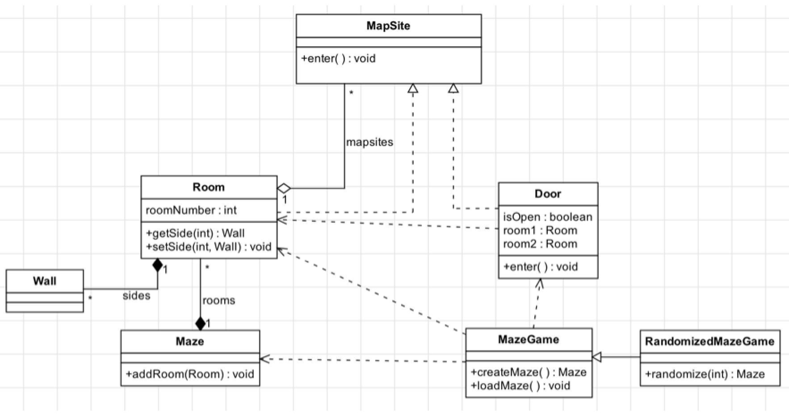

# Task 7

## Background

The UML class diagram below represents a game involving mazes that consist of rooms:

## Activity

Implement the design in Java by creating classes according to the class diagram and following these guidelines:

    You do not have to actually implement the methods and game logic, of course, but your code must compile: you can have methods return null as needed.
    You do not need to worry about any sort of main method or other classes/methods; just represent the classes as shown above.
    All fields and methods should be public (that’s what the little plus-sign next to the method names indicates). You do not need to worry about getters and setters.
    All classes and interfaces must be public.
    All concrete classes should have a no-argument constructor.
    Use arrays to implement multiplicity, e.g. if class Person has a “zero or more” relationship with class Pet, represent it as a Pet[ ] field in Person (as opposed to, say, a List<Pet> or Set<Pet>)
    MapSite should be an abstract class with a concrete “enter” method that does nothing.

    All classes must be in the default package, i.e. there should be no “package” declaration at the top of the source code.

## Helpful Hints

Think about how the different UML relationships are reflected in the implementation, and keep in mind that not all relationships imply that one class “is” or “has” another as a superclass or field.

Also pay close attention to how multiplicity is represented in the UML and think about what that means for the types of the fields.

If you're having trouble remembering the meaning of the different arrows, you can of course review the lesson, or look at this detailed reference guide: https://msdn.microsoft.com/en-us/library/dd409437.aspx
